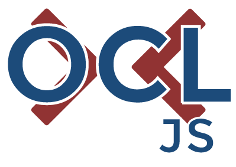

[](https://travis-ci.org/SteKoe/ocl.js)
[](https://david-dm.org/SteKoe/ocl.js#info=devDependencies)
[](https://opensource.org/licenses/MIT)

## OCL.js
The Object Constraint Language (OCL) is a language for describing rules that apply to MOF conform modelling languages like UML.
The OCL is a text based language that provides constraint and object query expressions that cannot be expressed by a meta modelling language.

## Example Page
To illustrate the usage of this library, an example web page has been set up [here](http://ocl.stekoe.de/).

## Supported concepts
This package does not fully conform to the OCL definition by OMG and implements a subset of the given concepts.

### Context
Define a valid context for the ocl rule. 
The context constraints the execution of an ocl rule to a specific type. 
Even though javascripts typesystem functions at a very low level, the context expression tries to guess the type as follows:

```
function Person() {}  => Person
class Person {}       => Person
{}                    => Object
function() {}         => undefined
```

When calling an OCL rule like the one below, it will only apply on objects which are of type "Person". 
"Type of" in context of OCL means, that the object is a direct instance of the given type.

``` ocl
context Person inv: [...]
```

### Invariants
#### =, <>, >, <, <=, >=
Start time of a meeting has to be before end time
``` ocl
context Meeting inv:
    self.end > self.start
```

A lecture hat to have a lecturer
``` ocl
context Lecture inv:
    self.lecturer <> nil
```

#### implies
If a person has children, the flag "isParent" has to be true
``` ocl
context Person inv:
    self.children <> nil implies self.isParent = true
```

#### and, or, xor
Concatenation of expressions using or/and:
``` ocl
context MetaAttribute inv:
    self.minCard <= self.maxCard or (self.minCard = nil and self.maxCard = nil)
```

### Collection operations
#### exists(expr)
Check if an element in a collection exists:
``` ocl
context Person inv:
    self.children->exists(c | c.age > 18)
```

#### isEmpty()
If a person does not have any children, the person is not a parent
``` ocl
context Person inv:
    self.children->isEmpty() implies self.isParent = false
```

#### isNotEmpty()
If a person has children, the flag "isParent" has to be true
``` ocl
context Person inv:
    self.children->isNotEmpty() implies self.isParent = true
```

#### select(expr)
Select all children from collection who are younger than 10 years old:
``` ocl
context Person inv:
    self.children->select(c | c.age < 10)
```

#### union(Collection)
Concatenates the two given collections and returns one single collection.

#### at(index:Number)
Returns the element of the collection at index *index*.

#### first()
Returns the first element of the collection.

#### last()
Returns the last element of the collection.

#### asSet()
Returns the given collection as set, containing unique entries.

#### size()
Returns the length of the given collection.

#### forAll
If a person has children, all children have to be younger than the parent.
``` ocl
context Person inv:
    self.children->forAll(c|c.age < self.age)
```
A person's children have to have distinguishable names:
``` ocl
context Person inv:
    self.children->forAll(c1, c2 | c1.name <> c2.name)
```


## LICENSE
MIT License

Copyright (c) 2016 Stephan Köninger

Permission is hereby granted, free of charge, to any person obtaining a copy
of this software and associated documentation files (the "Software"), to deal
in the Software without restriction, including without limitation the rights
to use, copy, modify, merge, publish, distribute, sublicense, and/or sell
copies of the Software, and to permit persons to whom the Software is
furnished to do so, subject to the following conditions:

The above copyright notice and this permission notice shall be included in all
copies or substantial portions of the Software.

THE SOFTWARE IS PROVIDED "AS IS", WITHOUT WARRANTY OF ANY KIND, EXPRESS OR
IMPLIED, INCLUDING BUT NOT LIMITED TO THE WARRANTIES OF MERCHANTABILITY,
FITNESS FOR A PARTICULAR PURPOSE AND NONINFRINGEMENT. IN NO EVENT SHALL THE
AUTHORS OR COPYRIGHT HOLDERS BE LIABLE FOR ANY CLAIM, DAMAGES OR OTHER
LIABILITY, WHETHER IN AN ACTION OF CONTRACT, TORT OR OTHERWISE, ARISING FROM,
OUT OF OR IN CONNECTION WITH THE SOFTWARE OR THE USE OR OTHER DEALINGS IN THE
SOFTWARE.

